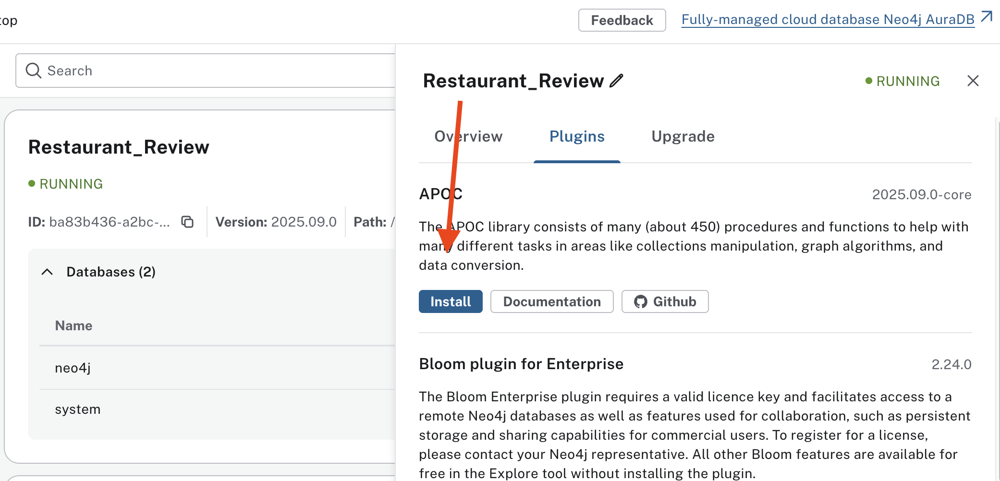

#  Installing and Using Neo4j Desktop

This guide will walk you through downloading, installing, and creating your first Neo4j instance using **Neo4j Desktop**.

---

## 1.  Download and Install Neo4j Desktop

1. Go to the [Neo4j Download Page](https://neo4j.com/download/) and click the **Download** button.  
   

2. After clicking **Download**, you’ll be redirected to a new page. Fill out the form to begin the download.  
   

3. Run the installer and accept the license agreement.  
   

---

## 2. Create a New Instance

4. In Neo4j Desktop, click **Create Instance**.  
   

5. Enter your **Instance Name** and **Password**.  
   - Example:  
     - Instance Name: `Restaurant_Review`  
     - Password: `12345678`  
   

6. Click the **Start** button to launch the instance.  
   

7. After a few seconds, you will see your instance running in Neo4j Desktop.  
   

---

# Setup Instructions for Neo4j Desktop

## 3. Install Required Plugins

8. **Download CSV Import Plugin**  
   Click  here to download the first plugin that will help import CSV files into Neo4j Desktop.

9. **Open Plugins List**  
   Click **Plugins** to view the available plugins.  
   

10. **Install APOC Plugin**  
   Click **Install** next to the APOC plugin.  
   

11. **Restart Instance**  
   Restart the `Restaurant_Review` instance.  
   

---

## 4. Install Extended APOC Plugin Manually

12. **Download APOC Extended JAR**  
   Visit the [APOC releases page](https://github.com/neo4j-contrib/neo4j-apoc-procedures/releases) and download  
   `apoc-2025.09.0-extended.jar`.  
   

13. **Open Database Path**  
   In Neo4j Desktop, click **Open Path**.  
   

14. **Navigate to Plugins Folder**  
   Locate and open the `plugins` folder.  
   

15. **Place APOC JAR in Plugins Folder**  
    Copy `apoc-2025.09.0-extended.jar` into the `plugins` folder.  
    

---

## 5. Configure APOC and Neo4j

16. **Return to Config Folder**  
    Navigate back to the previous folder.  
    

17. **Open Configuration Folder**  
    Enter the `conf` directory.  
    

18. **Create `apoc.conf` File**  
    Create a new file named `apoc.conf`.  
    

19. **Add APOC Configuration**  
    Open `apoc.conf` and add the following lines:
    ```properties
    apoc.import.file.enabled=true
    apoc.import.file.use_neo4j_config=true
    ```
    Save and close.  
    

20. **Edit `neo4j.conf`**  
    Open `neo4j.conf`.  
    

21. **Enable APOC Import in JVM**  
    Add the following line:
    ```properties
    server.jvm.additional=-Dapoc.import.file.enabled=true
    ```
    Save and close.  
    

---

## 6. Import CSV Files

22. **Return to Main Folder**  
    

23. **Open Import Folder**  
    Navigate into the `import` folder.  
    

24. **Copy CSV Files**  
    Copy 7 CSV files into this folder:  
    - `edges.csv` → relationships  
    - `nodes.csv` → nodes  

    ⚠️ Note: Headers must follow Neo4j’s strict naming conventions.  
    Refer to the [Neo4j Admin Import Guide](https://neo4j.com/docs/operations-manual/current/tutorial/neo4j-admin-import/).  
    

25. **Restart Neo4j Instance**  
    Restart the instance from Neo4j Desktop.  
      
    

---

## 7. Setup Python Environment 

26. **Install Anaconda (if not available)**  
    Download [Anaconda](https://www.anaconda.com/).

27. **Create and Activate Conda Environment**  
    Run the following in your terminal:
    ```bash
    conda create -n demo python=3.9
    conda activate demo
    conda install neo4j
    python import_csv.py
    ```

---

## 8. Query and Visualize Data

28. **Open Query Tab**  
    

29. **Connect Instance**  
    - Click to connect the instance.  
        
    - Select the database and connect.  
      

30. **Run Query**  
    Paste and run this query to visualize:
    ```cypher
    MATCH (n)
    OPTIONAL MATCH (n)-[r]-(m)
    RETURN n, r, m
    ```

      
      
    
